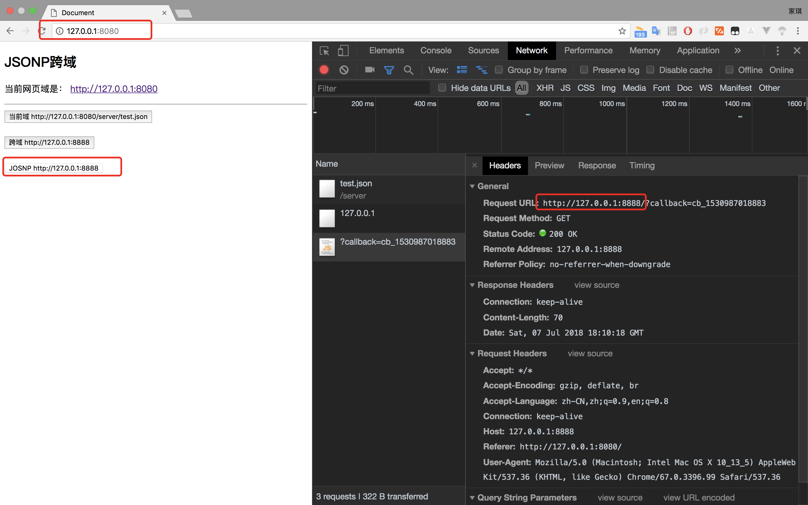

# JOSNP 跨域极简实现

------

这是一个简单的JSONP示例Demo，包含一个简单的非同源服务。**未处理相关边界条件，只作简单的JSONP原理使用。**

- 当前服务：http://127.0.0.1:8080/
- 跨域地址：http://127.0.0.1:8888/

## 启动

> 1. `yarn install` 或 `npm install`
> 1. `yarn start` 或 `npm run start`

**注**：跨域请求能发出去，服务端能收到请求并正常返回结果，只是结果被浏览器拦截。